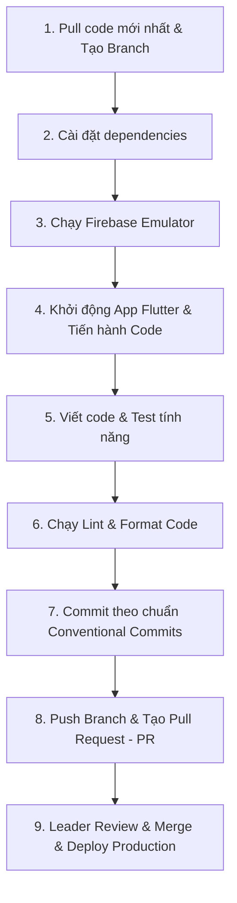

# FOORA - Development & Contribution Workflow (Dành cho Developer)

> **Lưu ý quan trọng**: Developer chỉ tập trung code và kiểm thử trên môi trường **Local (Firebase Emulator Suite & Android Emulator)**. Việc **Deploy lên Firebase Production** sẽ do **Tech Leader / DevOps đảm nhiệm**.

---

## 📌 Tổng quan quy trình làm việc (Workflow Overview)



---

## 🚀 Chi tiết các bước thực hiện từ đầu đến cuối

### Bước 1: Đồng bộ code mới nhất & Tạo Feature Branch

Trước khi bắt đầu bất kỳ task/tính năng mới nào, hãy luôn đồng bộ nhánh chính (`main`) và rẽ nhánh riêng:

```bash
# 1. Chuyển về nhánh chính và pull code mới nhất
git checkout main
git pull origin main

# 2. Tạo và chuyển sang nhánh mới cho tính năng của bạn
# Đặt tên nhánh rõ ràng: feature/ten-tinh-nang, fix/ten-loi, v.v.
git checkout -b feature/food-expiration-notification
```

---

### Bước 2: Cài đặt Dependencies

Đảm bảo cả Flutter (Frontend) và Cloud Functions (Backend) đều có đầy đủ thư viện:

```bash
# 1. Cài đặt Flutter packages
flutter pub get

# 2. Cài đặt Node.js packages cho Cloud Functions
cd functions
npm install
cd ..
```

---

### Bước 3: Khởi động Firebase Local Emulator

> **Tuyệt đối KHÔNG test trực tiếp ghi dữ liệu bừa bãi lên Firebase Production**. Toàn bộ quá trình code và test tính năng sẽ thực hiện với **Firebase Emulator Suite**.

Mở một cửa sổ Terminal riêng (Terminal 1) và chạy:

```bash
firebase emulators:start
```

- **Emulator UI**: Truy cập [http://localhost:4000](http://localhost:4000) trên trình duyệt để:
  - Xem/tạo dữ liệu Firestore trực quan.
  - Xem tài khoản Auth test.
  - Theo dõi trigger và log của Cloud Functions.

#### Nạp dữ liệu Master Data vào Firestore Emulator:
Sau khi Emulator đã chạy, nạp danh mục thực phẩm, thực phẩm, thời hạn bảo quản FEFO và gói thành viên vào Firestore Emulator bằng lệnh:

```bash
cd functions
npm run seed:emulator
cd ..
```

---

### Bước 4: Khởi động chế độ Watch cho Cloud Functions _(Nếu task có đụng tới Backend)_

Nếu bạn code hoặc chỉnh sửa Cloud Functions (TypeScript):
Mở một tab Terminal riêng (Terminal 2) tại thư mục `functions/`:

```bash
cd functions
npm run build:watch
```

> Lệnh này sẽ tự động biên dịch lại TypeScript sang JavaScript mỗi khi bạn nhấn Save (`Ctrl + S`), giúp Emulator cập nhật logic ngay lập tức.

---

### Bước 5: Chạy ứng dụng Flutter

Mở một tab Terminal khác (Terminal 3), khởi động Android Emulator (hoặc máy thật / Chrome Web) và chạy app:

```bash
# Chạy kết nối với Local Firebase Emulators (Mặc định khi dev - BẮT BUỘC cờ nạp API keys)
flutter run --dart-define-from-file=.env.json

# Chạy bản Web Admin (kết nối Local Emulators)
flutter run -d chrome --dart-define-from-file=.env.json

# Chạy với môi trường Production (kết nối trực tiếp live Firebase Cloud)
flutter run --dart-define-from-file=.env.json --dart-define=ENV=prod

# Chạy môi trường Dev kết nối live Firebase Cloud để test Firebase thật (tắt emulator)
flutter run --dart-define-from-file=.env.json --dart-define=USE_FIREBASE_EMULATOR=false
```

---

### Bước 6: Tiến hành Code & Kiểm thử (Development & Testing)

1. **Tuân thủ quy chuẩn dự án**:
   - Kiến trúc Flutter: Feature-Based Clean Architecture (xem chi tiết tại [`PROJECT_STRUCTURE.md`](./PROJECT_STRUCTURE.md)).
   - Quy tắc AI Code: Xem [`FOORA_AI_CODE_RULES.md`](./FOORA_AI_CODE_RULES.md).
   - Thiết kế Database / Collection: Xem [`DATABASE.md`](./DATABASE.md).
2. **Kiểm tra kỹ trên Emulator**:
   - Tạo dữ liệu mẫu trên Emulator UI (`http://localhost:4000`) để test các trường hợp biên (edge cases).
   - Kiểm tra log trên Flutter Console và Cloud Functions Emulator Console.

---

### Bước 7: Kiểm tra lỗi cú pháp, Lint & Định dạng code (Pre-Commit Check)

Trước khi commit, **bắt buộc** phải kiểm tra và dọn dẹp sạch sẽ toàn bộ cảnh báo / lỗi:

#### 1. Kiểm tra phần Flutter:

```bash
# Phân tích cú pháp và cảnh báo code Flutter
flutter analyze

# Format code sạch sẽ
dart format .
```

#### 2. Kiểm tra phần Cloud Functions _(Nếu có sửa)_:

```bash
cd functions
# Kiểm tra quy tắc ESLint
npm run lint

# Thử build bản hoàn chỉnh xem có lỗi TypeScript không
npm run build
cd ..
```

> ⚠️ **Quy tắc**: Chỉ commit khi `flutter analyze` và `npm run lint` không báo bất kỳ lỗi (Error) nào.

---

### Bước 8: Commit Code theo chuẩn Conventional Commits

Commit code với thông điệp rõ ràng, có tiền tố:

- `feat:` Tính năng mới.
- `fix:` Sửa lỗi.
- `refactor:` Tối ưu/cấu trúc lại code nhưng không đổi logic.
- `docs:` Sửa tài liệu.
- `style:` Format code, dấu cách, v.v.

```bash
git add .
git commit -m "feat(inventory): add FEFO priority sorting logic"
```

---

### Bước 9: Push Branch & Tạo Pull Request (PR)

1. **Push nhánh của bạn lên Remote Repository**:
   ```bash
   git push -u origin feature/food-expiration-notification
   ```
2. **Tạo Pull Request (PR)** trên GitHub / GitLab:
   - Base branch: `main`.
   - Compare branch: `feature/ten-tinh-nang`.
   - **Mô tả PR**:
     - Tóm tắt các thay đổi đã thực hiện.
     - Đính kèm ghi chú các cấu hình Firestore / Rule mới (nếu có) để Leader nắm thông tin.

---

### Bước 10: Quy trình của Tech Leader (Tham khảo)

Sau khi Dev tạo PR:

1. **Leader Review Code**: Nhận xét, yêu cầu chỉnh sửa (nếu cần) và Approve PR.
2. **Merge PR**: Gộp code vào nhánh chính (`main`).
3. **Deploy lên Firebase Production**:
   - Deploy Functions: `firebase deploy --only functions`
   - Deploy Firestore Rules/Indexes: `firebase deploy --only firestore:rules,firestore:indexes`
   - Deploy Storage Rules: `firebase deploy --only storage`
